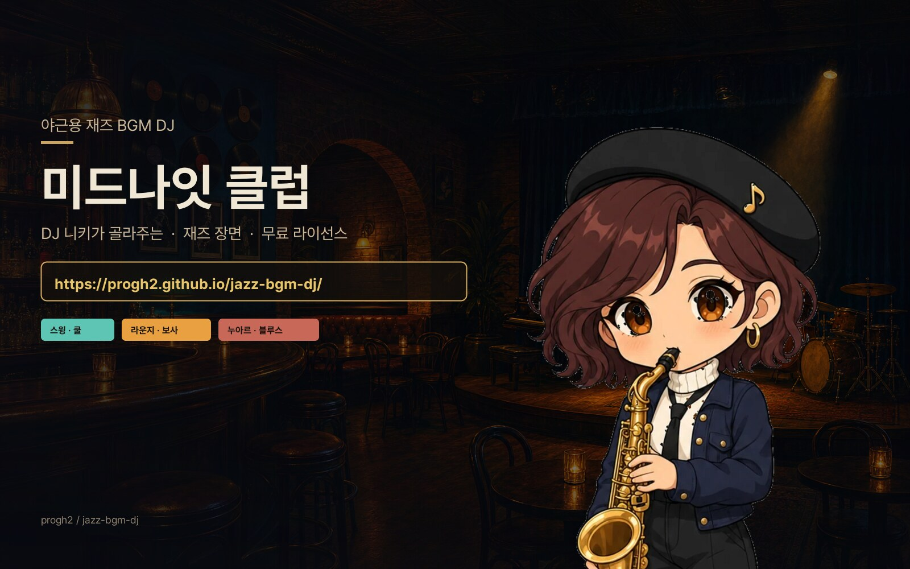

# 미드나잇 클럽 — 야근용 재즈 BGM DJ

[](https://progh2.github.io/jazz-bgm-dj/)

재즈·재즈 인접 분위기를 **34개 장면·장르 유형**으로 분류하고, 각 유형에 대응하는 **저작권 문제 없는 무료 라이선스 음원**을
모아, **미드나잇 재즈 클럽**으로 꾸민 재생기에서 틀어주는 프로젝트입니다. 기본 용도는 **야근하며 틀어놓기** — 밤이 깊을수록 클럽도 어두워지고 바 네온이 짙어집니다.

출발점은 [`rpg-bgm-dj`](https://github.com/progh2/rpg-bgm-dj) 의 구조(문답 선곡 · 홀/스킨 · 시간대 조명 · 비밀 · 합성 소리)를 그대로 두고, 판타지 비유를 재즈 클럽으로 갈아 끼운 리믹스입니다.

### ▶︎ https://progh2.github.io/jazz-bgm-dj/

클럽에 자리 잡은 **DJ 니키**가 네 마디 묻고, 그 자리에서 셋리스트를 짜 줍니다.

---

## 이 재생기가 하는 일

- **문답으로 즉석 선곡** — 집중(쫓김·쉼·몰입·지침) / 결(라운지·카페·누아르·발라드) / 노래 크기 / 뜨거운 곡 허용 여부를 묻고 40곡을 뽑습니다. 같은 사람 노래가 연달아 나오지 않게 흩뿌립니다.
- **클럽 홀** — 나무와 돌로 짠 가구, 인두로 지진 나무 팻말, 놋쇠 못과 밧줄. 가구는 CSS 그라디언트로, 벽과 바 카운터의 돌결은 그림 한 장을 soft-light 로 얹어 냅니다. 색은 CSS 가 내므로 장소를 갈아입어도 따라옵니다.
- **머물 곳 7군데** — 미드나잇 라운지 / 스피크이지 / 루프탑 / 비 오는 바 / 선데이 카페 / 야외 페스티벌 / 바이닐 룸. 목재·석재·쇠장식·네온색이 함께 바뀝니다.
- **시간대 조명** — 실제 시각에 따라 클럽이 일곱 단계로 어두워지고 바에 네온이 들어옵니다. 다만 **글자와 가구는 어둡게 하지 않습니다** — 새벽에 켜 두는 쓰임이라 읽기 어려워지면 앞뒤가 바뀝니다.
- **바 카운터와 셋리스트 대** — 노래가 시작되면 네온이 살아나고 바이닐이 돌며, 곡이 바뀌면 셋리스트 카드가 넘어갑니다. 카드에는 원곡으로 나가는 자리가 붙어 있어, 마음에 든 곡을 만든 사람에게 곧장 갈 수 있습니다.
- **네온과 바이닐** — 호박·청록·진홍 튜브와 CSS 바이닐. 재생 중일 때만 밝게 숨 쉽니다.
- **선반 위의 물건들** — 바 선반의 등불은 화면 켜두기, 놋쇠 열쇠는 유튜브 계정 연결의 **상태이자 스위치**입니다. 셋째 물건은 직접 찾아보세요.
- **칵테일 조율** — 레시피 카드가 속삭이는 비율(스피릿·시트러스·스위트)을 맞추고 Shake. 성공하면 잔이 레일에 올라 마실 수 있습니다. 틀리면 muddled.
- **합성 소리** — 문간 종, 네온 스파크, 셰이커, 잔 부딪는 소리, 턴테이블 건드리는 소리 등을 그 자리에서 만듭니다.
- **턴테이블 건드기기** — 니키의 턴테이블을 누르면 문답을 건너뛰고 그 자리에서 셋을 짜 줍니다. 지금이 몇 시인지를 보고 고릅니다 — 새벽 세 시에 페스티벌 곡을 틀지는 않습니다.
- **클럽 야사** — 홀에서 한 일이 한 줄씩 적힙니다. 못 찾아도 재생기 쓰는 데 지장은 없습니다.
- **장면 서랍** — 34개 장면을 직접 고르고 여럿 합칠 수 있습니다.
- **곡 내력과 이용 허락 상시 표시** — CC BY 계열은 출처 표기가 이용 조건이므로 항상 띄웁니다.
- **유튜브 계정 연결 (선택)** — 기본은 추적 쿠키 없는 `youtube-nocookie.com` 임베드. 「유튜브 계정」을 켜면 프리미엄이면 광고가 빠집니다.

키보드: `Space` 재생/일시정지, `Shift+←/→` 이전/다음 곡.

---

## 문서

| 파일 | 내용 |
|---|---|
| [`jazz_bgm_by_scene.md`](jazz_bgm_by_scene.md) | 1차 조사. 재즈·재즈 인접 분위기를 34개 장면·장르로 나눈 분류 체계 |
| [`jazz_bgm_free_playlist.md`](jazz_bgm_free_playlist.md) | 2차 결과. 분류에 맞춰 수집한 무료 음원 목록 (수집 진행 중) |

## 데이터

| 파일 | 용도 |
|---|---|
| `bgm-scenes.js` | 재생기가 읽는 데이터. `{id,title,artist,videoId,focus,length,license}` — 지금은 장면 스텁 |
| `data/bgm_playlist.json` | 전체 메타데이터(차순위 분류·출처 URL 포함) |
| `data/bgm_playlist.csv` | 스프레드시트로 훑어볼 때 |

다른 데서 쓰려면:

```js
import { BGM_BY_SCENE, FOCUS_PLAYLIST, buildPlaylist, creditFor } from './bgm-scenes.js';

const tracks = FOCUS_PLAYLIST;                                       // 집중도 4 이상 전체
const calm = buildPlaylist(['B3_cool','C1_lounge','D9_dawn'], 4);    // 장면 골라서
element.textContent = creditFor(currentTrack);                        // "Artist — CC BY 4.0"
```

## 집중도(focus)

작업하며 듣기 적합한 정도를 1~5로 매긴 값입니다.

- **5** 계속 틀어놔도 부담 없음 (쿨, 모달, 발라드, 라운지, 레인, 새벽)
- **4** 작업용으로 무난 (스윙 절제, 라틴, 블루스, 누아르, 스피크이지)
- **3** 상황에 따라 (하드밥, 소울, 페스티벌, 인트로)
- **1~2** 작업용 비권장 (비밥 과속, 퓨전 과격, 프리, 댄스플로어)

DJ 문답의 "노래는 어느 만큼 들리면 되겠습니까" 답변이 이 하한을 정합니다.

---

## 라이선스 주의

- 대부분 **CC BY** 계열을 목표로 모읍니다 — 출처 표기만 하면 상업 이용 포함 자유. 재생기에 아티스트명이 표시되는 것이 곧 준수입니다.
- 비상업 조건 곡이 섞이면 재생 시 경고가 뜹니다.
- YouTube의 "크리에이티브 커먼즈" 검색 필터 결과는 **의도적으로 제외**합니다. 업로더가 잘못 표시한 저작권 음원이 섞일 수 있기 때문입니다.
- **지금은 음원 수집 전**이라 `bgm-scenes.js` 의 곡 목록은 비어 있습니다. 장면 34종 ID만 잡혀 있습니다.

## 수집 재현

`tools/` 아래 파이프라인은 원본(`rpg-bgm-dj`)에서 가져온 것입니다. 재즈 채널·키워드에 맞춰 다시 돌리면 `bgm-scenes.js` 를 채울 수 있습니다.

```
tools/yt.py · channels.py · scrape_channels.py · classify.py · build.py
tools/verify.py · assemble.py · make_player_snippet.py · report.py
```

그림:

```
tools/gen_hearth_art.mjs   (레거시) 예전 난로 그림 파이프라인 — UI 는 더 이상 쓰지 않음
tools/make_hearth_art.mjs  (레거시) 〃
tools/make_bard_art.mjs    니키 넉 장 다듬기 (배경 파내기·얼굴 정렬)
```

자세한 규격은 [`assets/art/README.md`](assets/art/README.md) 에 있습니다.

## 재생기 구조

```
index.html              클럽 배치 (셋리스트는 카드 안)
assets/css/tavern.css   나무·돌 재질, 바 카운터·네온·칵테일 UI
assets/js/app.js        재생 제어 · YouTube · 상태
assets/js/bard.js       문답 정의와 셋리스트 짜기
assets/js/character.js  DJ 니키 그림 (SVG / dj-*.webp / 영상)
assets/js/halls.js      머물 곳 7군데
assets/js/hearth.js     시각에 따른 조명
assets/js/cocktails.js  바 칵테일 조율 미니게임
assets/js/roast.js      cocktails.js 호환 re-export
assets/js/sounds.js     Web Audio 합성 소리
assets/js/secrets.js    숨겨 둔 것과 야사
assets/js/moods.js      장면 → 분위기 → 색
assets/js/icons.js      문답 아이콘 (인라인 SVG)
```

지금 무대에 서는 니키는 `assets/art/dj-{idle,talk,dig,play}.webp` 넉 장입니다
(파일이 없으면 SVG 폴백이 대신 섭니다).
`character.js` 의 `ART.source` 를 `'svg'` 로 돌리면 벡터 DJ 로 돌아갑니다.

빌드 도구 없이 순수 ES 모듈로 동작합니다. 로컬에서 볼 때는 `python3 -m http.server` 로 띄우면 됩니다
(`file://` 로는 모듈 임포트가 막힙니다).
